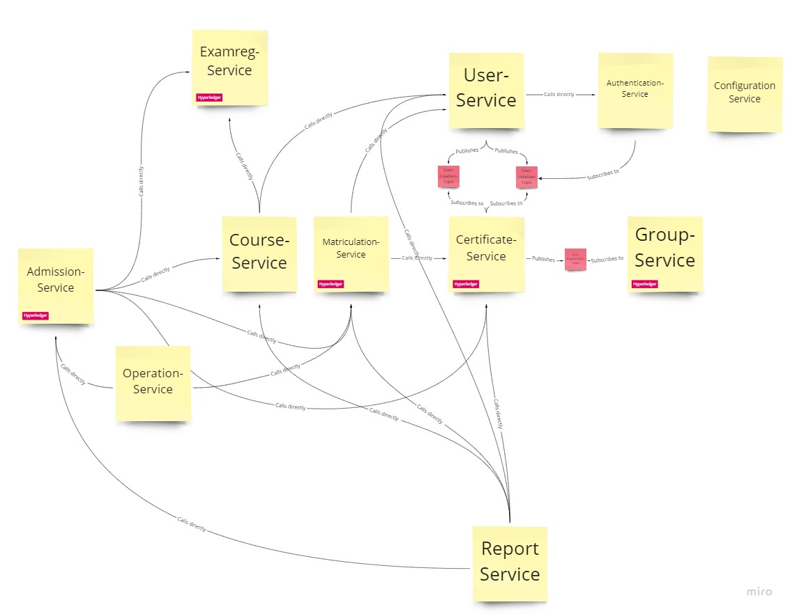

# Lagom backend implementation of UC4

## Current Status


## Table of Contents

  * [Versions in this project](#versions-in-this-project)
  * [Changes necessary on UNIX](#changes-necessary-on-unix)
  * [Running in development mode](#running-in-development-mode)
    * [Errors](#errors)
  * [Change settings of postgres](#change-settings-of-postgres)
  * [Dependecies of the different services](#dependecies-of-the-different-services)
  * [Running tests in IntelliJ](#running-tests-in-intellij)
  * [License](#license)

---

## Versions in this project
* Scala: 2.13.0  
* sbt: 1.4.3
* Java: 1.8
* Lagom: 1.6.4
* scalariform: 1.8.3
* scoverage: 1.6.0

## Changes necessary on UNIX
Add in .sbtopts '-J' in front of every parameter.
Should look like this:
```
-J-Xms512M
-J-Xmx6144M
-J-Xss2M
-J-XX:MaxMetaspaceSize=2048M
```

## Running in development mode
First start Postgres and Imagenary with the default settings:
```shell script
docker-compose up
```
Attention, this occupies your shell.  
You may want to detach with 'ctrl + d' or with '-d' flag. 

Use following command:
```shell script
sbt runAll
````
If you don\'t have sbt installed, you need to install [sbt](https://www.scala-sbt.org/).

### Errors
If you encounter any unexpected errors, use following command:
````shell script
sbt clean
````

If this doesn\'t help: Open an issue.

## Changelog

To get an overview of our development process, we tagged our releases and added changelogs for every service, like the one of the [user service](product_code/user_service/CHANGELOG.md), to our repository, which lists our different releases along with a description/enumeration of the changes between versions.
Each service has an individual tag which starts with the name of the service followed by the version-number.

## Create Docker Images
````sbtshell
sbt <name>_service/docker:publish
````

## Change settings of postgres
The configuration file used by the local docker image
are defined in the [postgres.conf](product_code/docker/postgres.conf).
This file will be load when postgres starts.

## Dependecies of the different services


The figure gives an overview of the internal communciation between services and therefore their dependencies. Inter-service communcation is either realized through service calls or a publish-subscribe pattern using Apache Kafka as a message broker. Service calls are synchronous HTTP calls that use the defined REST-API and publishing messages to Kafka allows asynchronous decoupled communication between services. Messages are published to topics which multiple services can subscribe to. Some services communicate with the underlying Hyperledger Fabric Framework. These services are marked with a red tag.

## Running tests in IntelliJ
IntelliJ expects some impressive Hardware.
To work around that fact you can tell it to use less Memory.
Instead of starting up VMs with ~ 1.5 GB you can tell the sbt to work on a max heap size of 512 MB.
````shell script
File
- Settings
    - Build, Execution, Deployment
      - BuildTools
        - sbt
          [ ] Maximum Heap Size (MB) [  512  ]
````

## License

Our source code files are made available under the Apache License, Version 2.0 (Apache-2.0), located in the [LICENSE](LICENSE) file.
